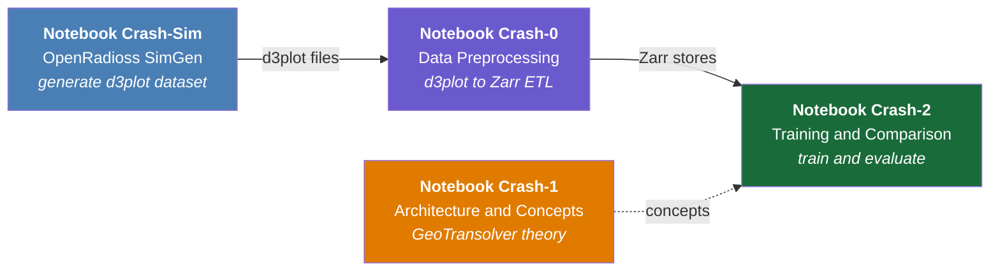
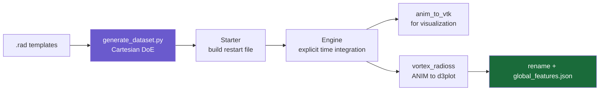
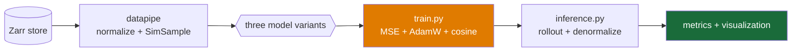

# Crash Simulation with GeoTransolver — Self-Paced Notebook Series

A hands-on, four-notebook course on building an **AI surrogate for automotive crash simulation**
using [NVIDIA PhysicsNeMo](https://github.com/NVIDIA/physicsnemo) and **GeoTransolver**.

You start with a raw structural solver, generate your own crash dataset, convert it into an
ML-ready format, learn the architecture from first principles, and finish by training and
comparing three different time-integration strategies.

> **This series is fully self-contained.** You do not need to have completed the Ahmed body
> CFD notebooks (`Notebook0`–`Notebook6`) first. Every concept — Physics-Attention, GALE,
> rollout strategies — is explained from scratch in Notebook Crash-1.

---

## The Problem

A crash simulation predicts how a vehicle structure deforms during an impact. Classically this
requires an explicit finite-element solver (LS-DYNA, Radioss, PAM-CRASH) running for minutes to
hours per configuration. Engineers need to explore hundreds of design variants — different
thicknesses, impact velocities, barrier positions — and the solver cost dominates the design cycle.

A trained surrogate predicts the full deformation trajectory in **seconds**, letting engineers
sweep the design space interactively and reserve the real solver for final verification.

**The learning task:**

| | |
|---|---|
| **Given** | Reference mesh geometry at `t=0`, per-node shell thickness, and three scalar conditions (impact velocity, thickness scale, barrier offset) |
| **Predict** | Node positions at all 51 timesteps — a tensor of shape `(N, T, 3)` with N ≈ 5,000–20,000 nodes |
| **Why it's hard** | Unlike steady-state CFD, the output is a *time-dependent trajectory*. Errors can compound across timesteps, and the physics is hyperbolic (wave-like) rather than elliptic |

---

## Series Overview



| # | Notebook | What you do |
|:-:|----------|-------------|
| **Sim** | `Notebook_Crash_SimGen-OpenRadioss.ipynb` | Generate your own crash dataset with OpenRadioss |
| **0** | `Notebook_Crash0-Data-Preprocessing.ipynb` | Convert d3plot binaries → Zarr stores |
| **1** | `Notebook_Crash1-Architecture-and-Concepts.ipynb` | Learn the architecture with NumPy blueprints |
| **2** | `Notebook_Crash2-Training-Integration-Comparison.ipynb` | Train and compare three rollout strategies |

### The full pipeline

You generate the dataset yourself with OpenRadioss, preprocess it, and train on it —
end to end, with no external dataset dependency:

```
Crash-Sim  →  Crash-0  →  Crash-2
                 ↑
              Crash-1 (concepts, independent)
```

> **Notebook Crash-1 is independent.** It runs on pure NumPy with no dataset at all — you can
> read it at any point, and it is the best starting place if you want the concepts before the code.

---

## Prerequisites

### Knowledge

| Required | Helpful but not required |
|----------|--------------------------|
| Python and NumPy | Prior deep-learning experience |
| Basic linear algebra (matrix multiply, dot product) | Familiarity with transformers/attention |
| Comfort running Jupyter notebooks | Finite-element or crash-simulation background |
| | PyTorch (only needed to modify the training code, not to run it) |

Everything transformer-specific is taught in Notebook Crash-1.

### Software

- **Linux x86-64** (Ubuntu 22.04 tested). The SimGen notebook requires Linux; the others work
  on macOS/Windows, though the training notebook needs an NVIDIA GPU.
- **Python 3.10+**
- **CUDA 12.x** and a recent NVIDIA driver (Crash-2 only)
- **Git** with `git-lfs`

---

## Setup

### Option 1 — Docker (recommended)

The PhysicsNeMo container has PyTorch, CUDA, and most dependencies preinstalled.

```bash
docker pull nvcr.io/nvidia/physicsnemo/physicsnemo:26.05

docker run --gpus all -it --rm \
  --shm-size=8g \
  -v $(pwd):/workspace \
  -p 8888:8888 \
  nvcr.io/nvidia/physicsnemo/physicsnemo:26.05

# Inside the container:
cd /workspace
jupyter lab --ip=0.0.0.0 --allow-root --no-browser
```

### Option 2 — Local virtual environment

```bash
python3 -m venv venv-crash
source venv-crash/bin/activate

# Core ML stack (match your CUDA version)
pip install torch --index-url https://download.pytorch.org/whl/cu121
pip install nvidia-physicsnemo

# Data pipeline
pip install "git+https://github.com/NVIDIA/physicsnemo-curator.git@main-backup#egg=physicsnemo-curator[mesh]"
pip install lasso-python zarr huggingface_hub hydra-core omegaconf

# Notebook + visualization
pip install jupyterlab numpy matplotlib pandas tabulate pyvista imageio
```

> **Important — use the `main-backup` branch of physicsnemo-curator.** The Zarr sink for crash
> data (`CrashZarrDataSource`) is not yet on `main`. Installing from `main` will fail in Crash-0
> Section 6 with a missing-sink error.

Each notebook also has its own install cell at the top, so you can run them without doing this
setup first — but doing it up front avoids surprises mid-notebook.

### Additional setup for Notebook Crash-Sim only

Required — Crash-Sim generates the dataset the rest of the series consumes.

```bash
# 1. Download the pre-built OpenRadioss binaries (~76 MB)
wget https://github.com/OpenRadioss/OpenRadioss/releases/download/latest-20260615/OpenRadioss_linux64.zip

# 2. Extract — note the zip creates /opt/OpenRadioss, not /opt/OpenRadioss_linux64
unzip OpenRadioss_linux64.zip -d /opt/

# 3. Rename to the path the notebook expects
mv /opt/OpenRadioss /opt/OpenRadioss_linux64

# 4. Set environment variables (add to ~/.bashrc to persist)
export OPENRADIOSS_ROOT=/opt/OpenRadioss_linux64
export LD_LIBRARY_PATH=$OPENRADIOSS_ROOT/extlib/h3d/lib/linux64:$OPENRADIOSS_ROOT/extlib/hm_reader/linux64:$LD_LIBRARY_PATH
export RAD_CFG_PATH=$OPENRADIOSS_ROOT/hm_cfg_files
export OMP_STACKSIZE=400m

# 5. Verify
$OPENRADIOSS_ROOT/exec/starter_linux64_gf -help
```

You also need the `vortex-radioss` converter, which is **not on PyPI**:

```bash
pip install git+https://github.com/Vortex-CAE/Vortex-Radioss.git
```

Finally, the `.rad` template decks must be downloaded manually from the OpenRadioss Confluence
(the CDN redirect blocks `wget` from inside containers — use a browser). Notebook Crash-Sim
Section 5 gives the exact URLs and target paths.

---

## The Notebooks in Detail

### Notebook Crash-Sim — OpenRadioss Dataset Generation

Generates the parameterised crash dataset the rest of the series consumes — from scratch,
with no external dataset dependency. You control the design of experiments and can
substitute your own geometry.

You run a six-step pipeline for each design point:



**The design of experiments** varies five parameters to produce 135 bumper beam runs:

| Parameter | What changes in the deck | Values | Count |
|-----------|--------------------------|--------|------:|
| Geometry scale | `/NODE` coordinates | (1,1,1), (1,0.5,1), (1,1,0.5), (1,2,1), (1,1,2) | 5 |
| Impact velocity | `/INIVEL` | −5, −3, −7 mm/ms | 3 |
| Shell thickness | `/PROP/SHELL` | 1.0×, 0.7×, 1.3× | 3 |
| Wall diameter | `/RWALL` | 254 mm | 1 |
| Wall origin | `/RWALL` | (−170, 0, 0), (−170, 120, 0), (−170, 240, 0) mm | 3 |

Total: 5 × 3 × 3 × 1 × 3 = **135 runs**

**Key things to know before you run it:**

- **Start with `USE_MINI_DOE = True`** (Section 7). This generates 2 runs instead of 135 and
  takes about five minutes — enough to verify the whole pipeline works before you commit hours.
- **Section 5.4 patches the engine deck.** The stock template only requests H3D output
  (proprietary Altair format). The patch cell inserts `/ANIM/DT` cards so the solver writes the
  open ANIM frames that `anim_to_vtk` and `vortex_radioss` need. Without this you get no
  `A001`, `A002`, … files and the d3plot conversion silently produces nothing.
  The patch uses a **5 ms** output interval to give **T = 51 frames over 250 ms**, matching what
  the Crash-2 model configs expect. If you change it, also change `training.num_time_steps`.
- **Never launch `engine_linux64_gf` by hand from `templates/`.** It needs `LD_LIBRARY_PATH`
  set and a `.rst` restart file from the Starter in the same directory. The notebook's
  `run_batch()` handles both. Running it manually gives
  `ERROR: H3D EXTERNAL LIBRARY NOT FOUND`.
- **Parallelism rule:** `MAX_PARALLEL_JOBS × OMP_NUM_THREADS ≤ total CPU cores`. The notebook
  auto-calculates this from `multiprocessing.cpu_count()`.

> **On the drop test.** Section 14 generates it, but the downstream notebooks are wired for the
> bumper beam only: Crash-0 and Crash-2 point at the bumper-beam paths, and the PhysicsNeMo
> recipe ships no drop-test config. Its conditioning variables also differ
> (`e_scale_mat*`, `rwall_orientation_*` vs the bumper beam's
> `velocity_x`, `thickness_scale`, `rwall_origin_y`). Treat it as a second worked example of the
> DoE machinery, not as a second training dataset — wiring it end to end needs a new config.

**Runtime:** ~5 min for the 2-run mini DoE; 2–6 hours for all 135 runs depending on core count.

**Output:** `data/bumperbeam_openradioss/RAW_DATA/Run0001/d3plot*` plus `global_features.json`.

Section 13 renders a displacement film-strip and an animated GIF so you can sanity-check the
physics before feeding the data forward.

---

### Notebook Crash-0 — Data Preprocessing (d3plot → Zarr)

Converts raw solver output into chunked, normalized Zarr arrays that the training pipeline
can read efficiently.

**What you learn:**

- How LS-DYNA stores crash data in the `d3plot` binary format, and how `lasso-python` parses it
  without needing an LS-DYNA licence
- Which `ArrayType` fields exist, and which four the curator actually reads:
  `node_coordinates`, `node_displacement`, `element_shell_node_indexes`,
  `element_shell_part_indexes` (plus `part_ids`). Stress and strain fields are available
  but optional for this task
- Why the raw data needs filtering, normalization, and splitting before training

**The ETL stages and why each exists:**

| Stage | Operation | Why |
|-------|-----------|-----|
| Read | `lasso.dyna.D3plot` parses the binary | d3plot is a packed FORTRAN format |
| Filter | Drop rigid-wall nodes | The barrier is not part of the deformable structure — including it corrupts the target field |
| Normalize | Per-field mean/std | Displacement (mm) and stress (MPa) differ by orders of magnitude |
| Split | Partition at the **run** level | Splitting by timestep would leak information between train and val |
| Write | Chunked, compressed Zarr | Random per-run access without loading 117 MB into RAM |

**Data source.** Crash-0 reads what Crash-SimGen produced. Set this at the top of Section 4:

```python
DATA_SOURCE = "simgen"      # reads ../data/bumperbeam_openradioss/RAW_DATA/
```

The cell verifies the expected `RAW_DATA/Run*/` layout is present and reports whether each run
has both a bare `d3plot` file and its `.k` thickness file before the ETL runs.

**Runtime:** ~15 min in demo mode; ~60 min for the full dataset.

**Output.** The ETL writes one flat store per run:

```
data/bumperbeam_zarr/Run100.zarr/  Run101.zarr/  ...
```

**Section 6.2 then reorganises these into the layout Crash-2 expects:**

```
data/bumperbeam_zarr/
├── train/Run1.zarr/  Run2.zarr/  ...
└── val/Run7.zarr/    ...
```

> **Do not skip Section 6.2**, and note the `.zarr` suffix is deliberately preserved —
> PhysicsNeMo's `zarr_reader` filters on it. If the stores are still flat, or the suffix is
> stripped, training silently sees zero runs.

Sections 7–8 validate shapes, plot dataset statistics, and animate the deformation straight
from the Zarr store — always run these before moving on. A silent ETL bug is much cheaper to
catch here than after a four-hour training run.

---

### Notebook Crash-1 — Architecture and Concepts

**Pure NumPy, no GPU, no dataset.** This is the conceptual core of the series and the one
notebook you should not skip.

**What you learn:**

1. **Why crash is harder than CFD.** Steady-state CFD predicts a field; crash predicts a
   trajectory. Time coupling introduces error accumulation that has no CFD analogue.

2. **The GeoTransolver architecture**, layer by layer — how the reference geometry enters via
   GALE cross-attention at every block, and how the three global scalars modulate the network
   FiLM-style.

3. **Physics-Attention** and why it matters here. Standard self-attention costs `O(N²)`; at
   N = 10,000 nodes that is 10⁸ operations per layer. Physics-Attention groups nodes into
   M ≈ 16 physics slices for `O(N·M + M²)` — a 625× reduction at that mesh size. In crash, the
   learned slices tend to align with structural zones: impact face, flanges, rear face.

4. **The four rollout strategies** — the central design decision — each with a runnable
   NumPy blueprint:

   | Strategy | Formulation | Training cost | Stability |
   |----------|-------------|---------------|-----------|
   | **One-shot** | `f(x₀, g) → (x₁…x_T₋₁)` | Low (1 sample/run) | High |
   | **Time-conditional** | `f(x₀, g, τ) → x_t` | High (T−1 samples/run) | High — best accuracy |
   | **Autoregressive** | `x_{t+1} = f(x_t, g)` | Medium | Degrades for T ≥ 30 |
   | **Teacher forcing** | Train on ground-truth inputs | High (T−1 samples/run) | Poor — train/test mismatch |

5. **Why autoregressive rollout drifts.** Section 5 demonstrates the compounding numerically —
   it is the same mechanism as accumulated error in explicit Euler integration, made worse
   because the model never saw its own mistakes during training.

6. **What GALE does.** In a deep stack, geometry information injected only at the input layer
   gets diluted. GALE re-injects the reference mesh at every block through a learned gate α,
   which rises near geometrically complex features (flanges, welds, holes) where the
   deformation mode depends strongly on shape.

**Runtime:** ~10 min to execute; budget 45–90 min to read and absorb.

---

### Notebook Crash-2 — Training and Integration Comparison

Trains real GeoTransolver models on the Zarr dataset and compares the rollout strategies
head to head.

**Prerequisite:** Notebook Crash-0 must have produced `data/bumperbeam_zarr/`.



**What you do:**

- Inspect the Zarr splits and confirm the shapes match what the model expects
- Walk through the Hydra config system so you can change hyperparameters without editing code
- See how each rollout strategy reshapes the same underlying data
- Launch training (three configs), then evaluate with MSE bar charts, L² error vs. timestep,
  and side-by-side predicted/ground-truth deformation plots
- Build an out-of-distribution guardrail so the surrogate flags inputs outside its training
  envelope instead of silently extrapolating

**Training commands** (run in a terminal, not the notebook, for anything long):

```bash
cd ../crash

python train.py \
  --config-name=bumper_geotransolver_oneshot \
  reader=zarr \
  training.raw_data_dir=../data/bumperbeam_zarr/train \
  training.raw_data_dir_validation=../data/bumperbeam_zarr/val \
  training.global_features_filepath=../data/bumperbeam_zarr/global_features.json \
  training.num_time_steps=51 \
  training.epochs=200 \
  training.ckpt_path=../checkpoints/oneshot \
  'datapipe.dynamic_targets=[]' \
  model.out_dim=150
```

> **Why those last three overrides.** The bumper configs default to `reader: vtp`, and ask for
> `effective_plastic_strain` / `stress_vm` as targets — fields our d3plots do not contain
> (the engine deck requests displacement only). Dropping the dynamic targets changes the
> output width to `(51 − 1) × 3 = 150`.

Substitute `bumper_geotransolver_time_conditional` (with `model.out_dim=3`) for the
time-conditional run. **There is no `bumper_geotransolver_ar_rollout` config** — AR-rollout is
composed from the one-shot config plus `model=geotransolver_autoregressive_rollout_training`;
see Notebook Crash-2 Section 7. For multi-GPU:

```bash
torchrun --nproc_per_node=4 train.py --config-name=bumper_geotransolver_oneshot
```

**Approximate training time, single A100, 100 epochs:**

| Method | Time |
|--------|-----:|
| One-shot | ~40 min |
| Time-conditional | ~80 min (T× more samples per epoch) |
| AR-rollout | ~40 min |

**Expected result.** One-shot and time-conditional converge to validation MSE in the
`10⁻³` range; AR-rollout degrades over the rollout horizon.

> **On the numbers you will see.** If no checkpoints are present, Section 8 populates the
> comparison metrics from the published benchmark ([arXiv:2510.15201](https://arxiv.org/abs/2510.15201))
> and Section 14's loss curves are synthetic. This lets you work through the analysis sections
> without a multi-hour training run first — but the plots are illustrative until you train and
> point `CKPT_DIR` at your own checkpoints.

Teacher forcing is discussed in Crash-1 but not trained here. Crash-1's comparison table gives
it validation MSE ≈ 0.3 against one-shot's 5.42 × 10⁻³ — roughly 55× worse, the clearest
illustration in the series of train/test distribution mismatch.

**Runtime:** ~30 min to walk through with simulated/pre-trained metrics; 2–4 h if you train from scratch.

---

## Suggested Schedule

Working through this at a comfortable pace:

| Session | Content | Duration |
|:-------:|---------|:--------:|
| 1 | Setup + Notebook Crash-1 (concepts first) | 2 h |
| 2 | Notebook Crash-0 — preprocess the generated data | 1.5 h |
| 3 | Notebook Crash-2 — walkthrough, launch a training run | 2 h |
| 4 | Notebook Crash-2 — evaluate results, OOD guardrails | 1.5 h |
| 5 *(optional)* | Notebook Crash-Sim — generate your own dataset | 3 h |

**A note on ordering.** The notebooks are numbered by data flow, not by teaching order. Many
people get more out of reading **Crash-1 first** — it explains *why* the pipeline is built the
way it is, which makes Crash-0's preprocessing choices much less arbitrary.

---

## Troubleshooting

### Notebook Crash-Sim

| Symptom | Cause | Fix |
|---------|-------|-----|
| `ERROR: H3D EXTERNAL LIBRARY NOT FOUND` | `LD_LIBRARY_PATH` not set, or engine launched manually | Export the variables in the Setup section; let `run_batch()` launch the solver |
| No `A001`, `A002`… files after the Engine step | Engine deck not patched for ANIM output | Run the Section 5.4 patch cell, then regenerate the run folders |
| `OPENRADIOSS_ROOT not found` | Zip extracts to `/opt/OpenRadioss` | `mv /opt/OpenRadioss /opt/OpenRadioss_linux64` |
| Only 2 runs generated | `USE_MINI_DOE = True` (the default) | Set it to `False` for the full 135-run sweep |
| Section 9 reports FAILED but `d3plot` files exist | Checking the post-rename name before Section 10 has run | Already handled — the cell now accepts both names. Re-run it |
| `wget` hangs downloading the `.rad` templates | Atlassian CDN redirect blocked in containers | Download in a browser and copy the files to `templates/` |
| Simulations run one at a time | `MAX_PARALLEL_JOBS` too low | It auto-calculates from core count; lower `OMP_NUM_THREADS` to raise it |

### Notebook Crash-0

| Symptom | Cause | Fix |
|---------|-------|-----|
| `CrashZarrDataSource` not found | Installed curator from `main` | Reinstall from the `main-backup` branch |
| `No d3plot files found` | Files still have the mesh-name prefix | Run the Section 10 rename step in Crash-Sim |
| `No cells left after filtering` | `wall_threshold` too aggressive | Raise it to 2.0 |
| Out of memory during ETL | Loading too many runs at once | Use `USE_MINI_DOE = True` in Crash-Sim, or lower the chunk size |
| Crash-2 later reports `Training runs: 0` | Section 6.2 split not run, or `.zarr` suffix stripped | Run Section 6.2 — stores must end up as `train/*.zarr` |

### Notebook Crash-2

| Symptom | Cause | Fix |
|---------|-------|-----|
| `Zarr store exists: False` | Crash-0 not run, or wrong path | Check `ZARR_ROOT` points at your Crash-0 output |
| CUDA out of memory | Mesh too large for available VRAM | Lower `datapipe.num_points`, or enable AMP |
| Training loss is `nan` | Learning rate too high, or unnormalized inputs | Lower `start_lr`; confirm Crash-0 normalization ran |
| AR-rollout diverges after ~30 steps | Expected behaviour | This is the error-accumulation effect from Crash-1 Section 5 — not a bug |
| Recipe clone fails | Sparse-checkout unsupported on old Git | Upgrade Git, or clone the full repo |

### General

| Symptom | Fix |
|---------|-----|
| Mermaid diagrams show as raw text | Use JupyterLab 4+, or view the notebook on GitHub. Content is unaffected |
| `Failed to load Xcursor library` warnings | Harmless VTK message during off-screen rendering — ignore |
| `psutil` / `numpy` pip conflict warnings | Harmless. Only the final `OK` lines matter |

---

## Repository Layout

```
Transolver/
│
├── README_Crash.md                                 ← this file (crash series)
├── README.md                                       ← Ahmed body CFD series (separate track)
│
│   ── Crash series ──
├── Notebook_Crash_SimGen-OpenRadioss.ipynb         ← optional dataset generation
├── Notebook_Crash_SimGen-OpenRadioss_run_on_cluster.ipynb   ← reference copy with saved outputs
├── Notebook_Crash0-Data-Preprocessing.ipynb
├── Notebook_Crash1-Architecture-and-Concepts.ipynb
├── Notebook_Crash2-Training-Integration-Comparison.ipynb
│
│   ── Ahmed body CFD series (not part of this track) ──
├── Notebook0-Data-Preprocessing.ipynb
├── Notebook1-Understanding-Transformers-and-Bottleneck.ipynb
├── Notebook2-Understanding-Transolver.ipynb
├── Notebook3-Training-Transolver.ipynb
├── Notebook4-Understanding-GALE-GeoTransolver.ipynb
├── Notebook5-Training-GeoTransolver.ipynb
├── Notebook6-Uncertainty-Quantification.ipynb
├── requirements.txt
├── utils/  fig/  *.pptx  patch_*.py
│
└── data/                                           ← created as you work
    ├── bumperbeam_openradioss/RAW_DATA/Run*/       ← Crash-Sim output (input to Crash-0)
    └── bumperbeam_zarr/
        ├── train/Run*.zarr/                        ← after Crash-0 Section 6.2
        └── val/Run*.zarr/
```

**About the cluster copy.** `Notebook_Crash_SimGen-OpenRadioss_run_on_cluster.ipynb` preserves
cell outputs from a real DGX run — useful for seeing what correct solver output looks like
without running the simulations. It is an *earlier snapshot* (31 cells vs 38): it lacks the
Series/Pipeline overview cells and the Section 13 visualization, and its section numbering
diverges after Section 12. Use the main notebook to actually run the pipeline.

---

## Further Reading

**Papers**

- [Transolver: A Fast Transformer Solver for PDEs on General Geometries](https://arxiv.org/abs/2402.02366) — Wu et al., 2024. The Physics-Attention mechanism.
- [GeoTransolver](https://arxiv.org/abs/2512.20399) — adds Geometry-Aware Layer Ensemble (GALE).
- [Automotive Crash Dynamics Modeling](https://arxiv.org/abs/2510.15201) — the crash-specific application this series follows.

**Code**

- [PhysicsNeMo crash recipe](https://github.com/NVIDIA/physicsnemo/tree/main/examples/structural_mechanics/crash)
- [PhysicsNeMo-Curator](https://github.com/NVIDIA/physicsnemo-curator) (use the `main-backup` branch)
- [OpenRadioss](https://github.com/OpenRadioss/OpenRadioss) and its [dataset generation scripts](https://github.com/NVIDIA/physicsnemo/tree/main/examples/structural_mechanics/openradioss_dataset_gen)
- [Underfill dispensing recipe](https://github.com/NVIDIA/physicsnemo/tree/main/examples/cfd/underfill_dispensing) — a closely related autoregressive GeoTransolver example on a different physics problem

**Related notebooks in this folder**

The Ahmed body CFD series (`Notebook0`–`Notebook6`, see `README.md`) covers the same
architecture applied to steady-state aerodynamics, plus uncertainty quantification via
MC-Dropout and Concrete Dropout. Useful if you want a second perspective on Physics-Attention
and GALE in a setting without the time dimension.
